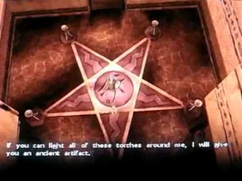
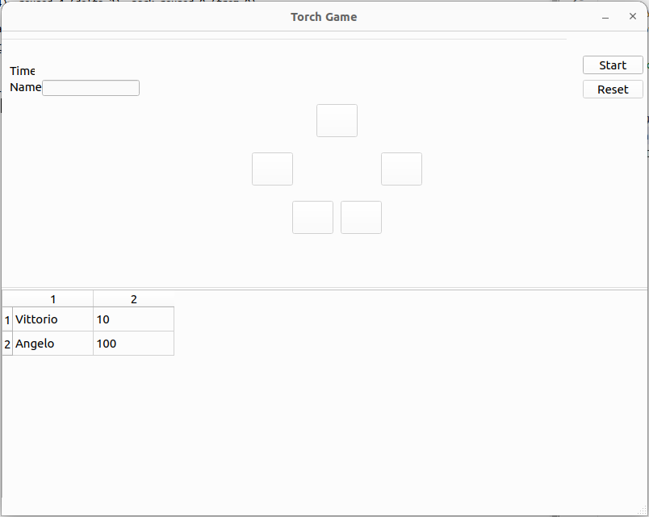

# Torch Game

Welcome to the **Torch Game**, a puzzle that challenges your logic and problem-solving skills! Get ready to dive into a world of light and shadows where every move counts.

This game is inspired by Sphinx and the cursed mummy puzzle.

---

## 📜 **Game Rules**

1. **Initial Setup**: The torches are arranged in a star shape.
2. **Interaction**:
   - When you light up a torch, the two torches directly opposite it also light up.
   - If you light up a torch that triggers already lit torches, they will turn off.
3. **Goal**: Light up all the torches at the same time!

---

## 🎮 **How to Play**

1. **Select a Torch**:
   - Click on the torch you want to light up.
   - Watch how other torches change their state.

2. **Think Strategically**:
   - Each lit or unlit torch impacts the game.
   - Find the right sequence to light up the entire star.

3. **Solve the Puzzle**:
   - Try different combinations.
   - Don’t give up: every mistake brings you closer to the solution!

---

## 🌟 **Key Features**

- 🕹️ **Intuitive Gameplay**: Simple rules with strategic depth.
- 🎨 **Attractive Design**: Minimalist and engaging visuals.
- 🎵 **Immersive Audio**: Relaxing sound effects to enhance the experience.
- 🔥 **Challenging Levels**: Multiple levels with increasingly complex patterns to solve.

---

## 🎮 **HMI**

---

## 🛠️ **System Requirements**

- **Supported Platforms**: Python 3.10 or higher
- **Required Storage**: 100 MB of free space
- **Minimum RAM**: 2 GB

---

## 📚 **Installation Instructions**

1. Download the game from [our official website](#).
2. Follow the provided installation steps.
3. Launch the game and light up the star!

---

### 💡 Light up the torches, illuminate the star, and win the challenge!
